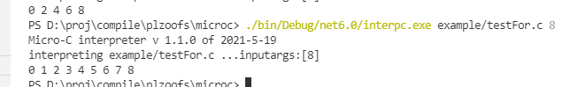
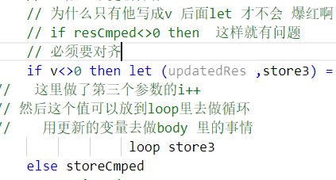

PS D:\proj\compile\plzoofs\microc> ./bin/Debug/net6.0/interpc.exe example/testFor.c 8
Micro-C interpreter v 1.1.0 of 2021-5-19
interpreting example/testFor.c ...inputargs:[8]
0 1 2 3 4 5 6 7 8 

for 循环 测试






不对齐就错了


解释器怎么写

D:\proj\compile\plzoofs\microc\Interp.fs

这里写具体逻辑

```fsharp
| For(assignedStmt,cmpStmt,updateStmt,body) -> 
          let (resAssigned ,storeAssigned) = eval assignedStmt locEnv gloEnv store
        //   获得初始值
          let rec loop storeOrigin =
                //求值 循环条件,注意变更环境 store
                // 这里是做判断 是for 的第二个参数  i<n
                let (resCmped, storeCmped) = eval cmpStmt locEnv gloEnv storeOrigin
                // 继续循环
                // 不是0 就不停止
                // body 里面可能也会改变变量的 比如 
                // for(i=0;i<n;i++){
                //     i++
                // }
                // 所以要返回body里面改变过的变量 
                // 去做一个更新操作 
                // 为什么只有他写成v 后面let 才不会 爆红啊
                // if resCmped<>0 then  这样就有问题
                // 必须要对齐
                if resCmped<>0 then 
                    let (updatedRes ,updatedStore) = eval updateStmt locEnv gloEnv (exec body locEnv gloEnv storeCmped)
                //   这里做了第三个参数的i++ 
                // 然后这个值可以放到loop里去做循环
                //    用更新的变量去做body 里的事情
                    loop updatedStore
                
                else storeCmped  
          loop storeAssigned
```

这里定义名字

Absyn.fs

 | For of expr * expr * expr * stmt   

各个参数是什么类型的


这里定义关键词

CLex.fs

| "for"   -> FOR


不知道 CLex.fsl 是不是也要一起写 关键词。。

| "for"   -> FOR

尝试把他注释了，

PS D:\proj\compile\plzoofs\microc> ./bin/Debug/net6.0/interpc.exe example/testFor.c 8
Micro-C interpreter v 1.1.0 of 2021-5-19
interpreting example/testFor.c ...inputargs:[8]
ERROR: parse error in file example/testFor.c near line 6, column 13

报错，可见fsl不写关键词的话 是不行的

把 CLex.fs 的 for的关键词定义删掉 ，（| "for"   -> FOR） 也是不行的。。

这两个都要写，不过他们干的活如此相似，却两边都要写，比较奇怪啊 。。没什么代码生成之类的吗。。


这里要配置他的参数位置

CPar.fsy

| FOR LPAR Expr SEMI Expr SEMI Expr RPAR StmtM   { For($3,$5,$7,$9) }

也要写token  在上面

WHILE FOR


CPar.fs  CPar.fsi

这个就不用管了，是自动生成的


编译

 dotnet build -v n interpc.fsproj


没有生成出来

可能是因为CLex.fsl 的声明没有写吧


     1>D:\proj\compile\plzoofs\microc\CPar.fs(1,1): error FS0222: 库或多文件应用程序中的文件必须以命名空间或模块声明开头，例如 "namespace SomeNamespace.SubNamespace" 或 "module SomeNamespace.SomeModule"。仅应用程序的最后一个源文件可以忽略此类声明。 [D:\proj\compile\plzoofs\microc\interpc.fsproj]
     1>已完成生成项目“D:\proj\compile\plzoofs\microc\interpc.fsproj”(默认目标)的操作 - 失败。


​    

东西都没了 CPar.fsi 说明这个文件的代码都是他自己生成的吧。。但是没了 咋办。。我哪里写错了。。

CPar.fs

里面 东西会没有  是因为CPar.fsy的token 没有写


运行

 ./bin/Debug/net6.0/interpc.exe example/doWhileTest.c 8

dowhile 测试

```c
void main(int n)
{
    int i;
    i = 0;
    do
    {
        print i;
        i=i+1;
    } while (i < n);
}

```

输出

PS D:\proj\compile\plzoofs\microc>  ./bin/Debug/net6.0/interpc.exe example/doWhileTest.c 8
Micro-C interpreter v 1.1.0 of 2021-5-19
interpreting example/doWhileTest.c ...inputargs:[8]
0 1 2 3 4 5 6 7 