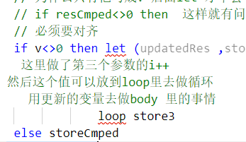

### 编译原理大作业 F#实现microc语言

- 课程名称：编程语言原理与编译

- 实验项目：期末大作业

- | 姓名   | 班级       | 学号     |
  | ------ | ---------- | -------- |
  | 缪奇鹏 | 计算机1903 | 31901077 |
  | 邵彦廷 | 计算机1902 | 31902099 |

- 实验指导教师: 张芸

## 简介

基于microc项目，增加了一些特性，使用F#语言实现类C语言的解释器、编译器

## 文件结构 

- 前端：由`F#`语言编写而成  
  - `Absyn.fs`: 抽象语法树结构的定义
  - `CLex.fsl`: 词法定义
    - `CLex.fs`：由`CLex.fsl`生成的词法分析器
  - `CPar.fsy`: 语法定义
    - `CPar.fs`：由`CPar.fsy`生成的语法分析器
  - `Parse.fs`: 语法解析器（从文件或字符串中获取抽象语法树）
  - `Interp.fs`: 解释器
  - `Comp.fs`: 编译器
  - `Contcomp.fs`: 优化编译器
  - `Machine.fs`: 栈式虚拟机指令的定义及将其转化为机器指令序列
- 后端：由`F#`语言编写而成

  - `Backend.fs`: 生成汇编代码
- 测试：测试程序放在`example`文件夹内
- 库：.net6

#### 用法

###### 编译器运行

在 runCompile.py文件中编写要运行的程序目录和参数

path=r"example\return"

args="7"

在vscode中安装code runner，python插件，安装python，点击右上角运行按钮


##### 解释器运行

修改run.cmd中的需要运行的文件和参数，同样点击运行

powershell  ./bin/Debug/net6.0/interpc.exe example\testPrim3.c 2

建议复制已有的语句，粘贴一句，注释掉上面的一句，这样之前运行过的代码都有记录

#### 中间代码生成

 可见example目录里的.ins 和.insx86 文件

#### 目标代码生成

见example目录里的 .out 文件, Machine.fs可以根据不同的汇编生成code，也就是out文件

#### 语法分析结果 举例

生成了语法分析树

topdecs [Fundec
  (None, "main", [(TypI, "n")],
   Block
     [Dec (TypI, "i"); Stmt (Expr (Assign (AccVar "i", CstI 0)));
      Stmt
        (While
           (Prim2 ("<", Access (AccVar "i"), Access (AccVar "n")),
            Block
              [Stmt
                 (If
                    (Prim2 ("==", Access (AccVar "i"), CstI 1),
                     Block
                       [Stmt
                          (Expr
                             (Assign
                                (AccVar "i",
                                 Prim2 ("+", Access (AccVar "i"), CstI 1))));
                        Stmt Continue], Block []));
               Stmt (Expr (Prim1 ("printi", Access (AccVar "i"))));
               Stmt


PS D:\proj\compile\plzoofs\microc> ./bin/Debug/net6.0/interpc.exe example/testFor.c 8
Micro-C interpreter v 1.1.0 of 2021-5-19
interpreting example/testFor.c ...inputargs:[8]
0 1 2 3 4 5 6 7 8 

## 解释器 测试

#### for 循环 测试


不对齐就错了




解释器怎么写

D:\proj\compile\plzoofs\microc\Interp.fs

**这里写具体逻辑**

```fsharp
| For(assignedStmt,cmpStmt,updateStmt,body) -> 
          let (resAssigned ,storeAssigned) = eval assignedStmt locEnv gloEnv store
        //   获得初始值
          let rec loop storeOrigin =
                //求值 循环条件,注意变更环境 store
                // 这里是做判断 是for 的第二个参数  i<n
                let (resCmped, storeCmped) = eval cmpStmt locEnv gloEnv storeOrigin
                // 继续循环
                // 不是0 就不停止
                // body 里面可能也会改变变量的 比如 
                // for(i=0;i<n;i++){
                //     i++
                // }
                // 所以要返回body里面改变过的变量 
                // 去做一个更新操作 
                // 为什么只有他写成v 后面let 才不会 爆红啊
                // if resCmped<>0 then  这样就有问题
                // 必须要对齐
                if resCmped<>0 then 
                    let (updatedRes ,updatedStore) = eval updateStmt locEnv gloEnv (exec body locEnv gloEnv storeCmped)
                //   这里做了第三个参数的i++ 
                // 然后这个值可以放到loop里去做循环
                //    用更新的变量去做body 里的事情
                    loop updatedStore
                
                else storeCmped  
          loop storeAssigned
```

**这里定义名字**

Absyn.fs

 | For of expr * expr * expr * stmt   

各个参数是什么类型的

**这里定义关键词**

CLex.fs

| "for"   -> FOR

不知道 CLex.fsl 是不是也要一起写 关键词。。

| "for"   -> FOR

尝试把他注释了，

PS D:\proj\compile\plzoofs\microc> ./bin/Debug/net6.0/interpc.exe example/testFor.c 8
Micro-C interpreter v 1.1.0 of 2021-5-19
interpreting example/testFor.c ...inputargs:[8]
ERROR: parse error in file example/testFor.c near line 6, column 13

报错，可见fsl不写关键词的话 是不行的

把 CLex.fs 的 for的关键词定义删掉 ，（| "for"   -> FOR） 也是不行的。。

这两个都要写，不过他们干的活如此相似，却两边都要写，比较奇怪啊 。。没什么代码生成之类的吗。。

**这里要配置他的参数位置**

CPar.fsy

| FOR LPAR Expr SEMI Expr SEMI Expr RPAR StmtM   { For($3,$5,$7,$9) }

也要写token  在上面

WHILE FOR

CPar.fs  CPar.fsi这个就不用管了，是自动生成的

**文档**

文档：It means take the value on top of th...
链接：http://note.youdao.com/noteshare?id=a2d913f91e09a57167afa49d13b4d92a&sub=90C582B31A324D8E8A2CCECAAEE43E56

**编译**

 dotnet build -v n interpc.fsproj

[IntelliJ IDEA自定义快捷键绑定执行终端命令_fuliyefly的博客-CSDN博客_idea自定义命令](https://blog.csdn.net/fuliyefly/article/details/118102204)

文档：ASSIGN COMPONENT comp OF STRUCTURE s...
链接：http://note.youdao.com/noteshare?id=e302b24ec117874a3970c42b6899714c&sub=7511852883BF43538C90D85573E11A89


没有生成出来，可能是由于CLex.fsl 的声明没有写的原因

     1>D:\proj\compile\plzoofs\microc\CPar.fs(1,1): error FS0222: 库或多文件应用程序中的文件必须以命名空间或模块声明开头，例如 "namespace SomeNamespace.SubNamespace" 或 "module SomeNamespace.SomeModule"。仅应用程序的最后一个源文件可以忽略此类声明。 [D:\proj\compile\plzoofs\microc\interpc.fsproj]
     1>已完成生成项目“D:\proj\compile\plzoofs\microc\interpc.fsproj”(默认目标)的操作 - 失败。


 东西都没了 CPar.fsi 说明这个文件的代码都是他自己生成的。但是没了 咋办。。我哪里写错了。。

CPar.fs里面 东西会没有  是因为CPar.fsy的token 没有写

**运行**

 ./bin/Debug/net6.0/interpc.exe example/doWhileTest.c 8

 ./bin/Debug/net6.0/interpc.exe example/testFloat.c 8

#### dowhile 测试 解释器

```c
void main(int n)
{
    int i;
    i = 0;
    do
    {
        print i;
        i=i+1;
    } while (i < n);
}

```

输出

PS D:\proj\compile\plzoofs\microc>  ./bin/Debug/net6.0/interpc.exe example/doWhileTest.c 8
Micro-C interpreter v 1.1.0 of 2021-5-19
interpreting example/doWhileTest.c ...inputargs:[8]
0 1 2 3 4 5 6 7 

代码位置

PS D:\proj\compile\plzoofs\microc

until 是一个token，需要定义

LE DO DOUNTIL UNTIL

    “D:\proj\compile\plzoofs\microc\interpc.fsproj”(默认目标) (1:7) ->
       (CallFsYacc 目标) ->
         FSYACC : error FSY000: NonTerminal 'UNTIL' has no productions [D:\proj\compile\plzoofs\microc\interpc.fsproj]
         C:\Users\iot421\.nuget\packages\fslexyacc\10.2.0\build\FsLexYacc.targets(53,3): error MSB3073: 命令“dotnet "C:\Users\iot421\.nuget\packages\fslexyacc\10.2.0\build\/fsyacc/netcoreapp3.1\fsyacc.dll"  -o "CPar.fs" --module CPar CPar.fsy”已退出，代码为 1。 [D:\proj\compile\plzoofs\microc\interpc.fsproj]


   ./bin/Debug/net6.0/interpc.exe example/testDoUntil.c 8

PS D:\proj\compile\plzoofs\microc> ./bin/Debug/net6.0/interpc.exe example/testDoUntil.c 8
Micro-C interpreter v 1.1.0 of 2021-5-19
interpreting example/testDoUntil.c ...inputargs:[8]
ERROR: parse error in file example/testDoUntil.c near line 10, column 9

大概是until  这里没定义  CLex.fs

#### 测试 doUtil  解释器

```c
void main(int n)
{
    int i;
    i = 0;
    do
    {
        print i;
        i = i + 1;
    }
    until(i > n);
}

```

输出

PS D:\proj\compile\plzoofs\microc> ./bin/Debug/net6.0/interpc.exe example/testDoUntil.c 8
Micro-C interpreter v 1.1.0 of 2021-5-19
interpreting example/testDoUntil.c ...inputargs:[8]
0 1 2 3 4 5 6 7 8 

#### 编译器  测试 doUtil

参数  args="7"			输出  0 1 2 3 4 5 6 7 

#### 三元 解释器

 ./bin/Debug/net6.0/interpc.exe example/testPrim3.c 8  

这好像不能解析	print n > 5 ? 1 : 0;

一开始把他当作是stmt了，但是后来发现他要返回东西的 所以是expr

测试

```c
void main(int n)
{
     int res;
     res=n > 5 ? 1 : 0;
    //  他要返回一个值的 貌似不是stmt ，而是表达式吧。。？
     print res;
    // print n > 5 ? 1 : 0;
}
```

输出

PS D:\proj\compile\plzoofs\microc>  ./bin/Debug/net6.0/interpc.exe example/testPrim3.c 8
Micro-C interpreter v 1.1.0 of 2021-5-19
interpreting example/testPrim3.c ...inputargs:[8]
1 

PS D:\proj\compile\plzoofs\microc>  ./bin/Debug/net6.0/interpc.exe example/testPrim3.c 1  
Micro-C interpreter v 1.1.0 of 2021-5-19
interpreting example/testPrim3.c ...inputargs:[1]
0

./bin/Debug/net6.0/interpc.exe example\charArrTest.c

不行

./bin/Debug/net6.0/interpc.exe example/testString.c 1   


尝试 字符串

编译

dotnet build -v n interpc.fsproj

  D:\proj\compile\plzoofs\microc\CLex.fsl(37,20): error FS0039: 未定义值或构造函数“STRING”。 你可能需要以下之一:   string   String   sinh   stdin   CSTINT [D:\proj\compile\plzoofs\microc\interpc.fsproj]


配置类型

Type:

  INT                 { TypI   }

 | CHAR                { TypC   }

CPar.fsy


1>FSYACC : error FSY000: NonTerminal 'STRING' has no productions [D:\proj\compile\plzoofs\microc\interpc.fsproj]


看不懂 为什么他的int就可以。


| '"'       { CSTSTRING (String [] lexbuf) }  // 调用字符串处理规则

这里来开始调用const String


char arr 是不是要尝试 int 的arr那样，要找找 int arr


 D:\proj\compile\plzoofs\microc\Interp.fs(241,33): error FS0039: 未定义值或构造函数“CHAR”。 你可能需要以下之一:   char   CPar [D:\proj\compile\plzoofs\microc\interpc.fsproj]


./bin/Debug/net6.0/interpc.exe example\testChar.c 1 

ERROR: Lexer error: illegal symbol in file example\testChar.c near line 4, column 8


D:\school\compile\plzoofs\microc>powershell ./bin/Debug/net6.0/interpc.exe example\testChar.c 1
Micro-C interpreter v 1.1.0 of 2021-5-19
interpreting example\testChar.c ...inputargs:[1]
topDecs [Fundec
  (None, "main", [(TypI, "n")],
   Block
     [Dec (TypC, "ch"); Stmt (Expr (Assign (AccVar "ch", CstChar 'c')));
      Stmt (Expr (Prim1 ("printc", Access (AccVar "ch"))));
      Stmt (Expr (Prim1 ("printc", Access (AccVar "ch")))); Dec (TypC, "ret")])]

脚本运行 run.cmd

简单 不会忘记命令，管理方便

./bin/Debug/net6.0/interpc.exe example\array.c 1 

PS D:\proj\compile\plzoofs\microc> ./bin/Debug/net6.0/interpc.exe example\array.c   
Micro-C interpreter v 1.1.0 of 2021-5-19
interpreting example\array.c ...inputargs:[]
9 


定义的时候初始化

(base) D:\school\compile\plzoofs\microc>powershell  ./bin/Debug/net6.0/interpc.exe example\testDecAndAssign.c 1  
3.2

```
void main(int n)
{
    float f = 3.2;
    printf("%f",f);
}
```

int 可以 只有int 一种类型吗。

 Debug.fs
         CPar.fs
         CLex.fs
         Parse.fs
         Machine.fs
         Interp.fs

build的时候有       Machine.fs ，应该没有    Machine.java

```c
void main(int n)
{
    char ch;
    // ch='1';
    // 是说单引号不对吗
    // ERROR: Lexer error: illegal symbol in file example\testChar.c near line 4, column 8
    print ch;
}
```

PS D:\proj\compile\plzoofs\microc> ./bin/Debug/net6.0/interpc.exe example\testChar.c 1 
Micro-C interpreter v 1.1.0 of 2021-5-19
interpreting example\testChar.c ...inputargs:[1]
0 

这样赋值没有问题，那么是解析单引号的时候出问题了

 ./bin/Debug/net6.0/interpc.exe example\testChar.c 1 

 ./bin/Debug/net6.0/interpc.exe example\testString.c 1 

 ./bin/Debug/net5.0/interpc.exe example\testChar.c 1 

PS D:\proj\compile\micro-c\microc>  ./bin/Debug/net5.0/interpc.exe example\testChar.c 1 
It was not possible to find any compatible framework version
The framework 'Microsoft.NETCore.App', version '5.0.0' (x64) was not found.

  - The following frameworks were found:
    6.0.3 at [C:\Program Files\dotnet\shared\Microsoft.NETCore.App]

You can resolve the problem by installing the specified framework and/or SDK.

#### 测试 打印char，

```c
void main(int n)
{
    char ch;
    // ch='1';
    // 是说单引号不对吗
    // ERROR: Lexer error: illegal symbol in file example\testChar.c near line 4, column 8
    // ch = "1";
    // ch = "c";
// ch="c";
ch='c';
    // print ch;
// println ch;
// printc ch;
printCh ch;
}

```

PS D:\proj\compile\plzoofs\microc>  ./bin/Debug/net6.0/interpc.exe example\testChar.c 1
Micro-C interpreter v 1.1.0 of 2021-5-19
interpreting example\testChar.c ...inputargs:[1]
c

一旦他可以打印char ，那么什么都可以打印了，函数只要在c代码层定义，而不需要写f# 代码了

  ./bin/Debug/net6.0/interpc.exe example\testPrintf.c 1

example\testPrintf.c


  ./bin/Debug/net6.0/interpc.exe example\testString.c 1

printf "%s",s;

ERROR: parse error in file example\testString.c near line 13, column 11

定义 string 没问题 但是printf 有问题啊


./bin/Debug/net6.0/interpc.exe example\charArrTest.c  1

PS D:\proj\compile\plzoofs\microc> ./bin/Debug/net6.0/interpc.exe example\charArrTest.c  
Micro-C interpreter v 1.1.0 of 2021-5-19
interpreting example\charArrTest.c ...inputargs:[]
1


可以print Char Arr 里的一个char

有了char arr 意味着有了str

```
char charArr[2];
charArr = "23";
```

但是这样不行，因为没有做过这种定义。。

PS D:\proj\compile\plzoofs\microc>   ./bin/Debug/net6.0/interpc.exe example\testString.c 1
Micro-C interpreter v 1.1.0 of 2021-5-19
interpreting example\testString.c ...inputargs:[1]
开始调用字符串的开始
加载字符串结束。。
['1'; '4'; '1'; '4'; '1'; '3'; '1']
开始调用字符串的开始
加载字符串结束。。
['s'; '%']
ERROR: parse error in file example\testString.c near line 15, column 11


PrintfArgs:

  /* empty */             { [] }

 | COMMA Expr             { [$2] }

 // 空的 和一个参数的情况不能不写


不能没有括号

// printf "%s",s;


#### 测试 打印string  解释

```c
void main(int n)
{
    String s ;
s="1314141";
printf ("%s %s",s,s);
}
```

PS D:\proj\compile\plzoofs\microc>   ./bin/Debug/net6.0/interpc.exe example\testString.c 1
Micro-C interpreter v 1.1.0 of 2021-5-19
interpreting example\testString.c ...inputargs:[1]

114141 114141

打印map

[starplatinum111/testRider - 码云 - 开源中国 (gitee.com)](https://gitee.com/starplatinum111/test-rider/tree/master)

[汇编中的LABEL详解_deniece1的博客-CSDN博客_汇编label](https://blog.csdn.net/deniece1/article/details/103213681)


```
void main(int n)
{
    int i;
    i = 0;
    for (i = 0; i < n; i = i + 1)
    {
        print i;
        break;
    }
      print i;
}
```

#### break 解释器

PS D:\school\compile\plzoofs\microc> ./bin/Debug/net6.0/interpc.exe example/breakTest.c 8
Micro-C interpreter v 1.1.0 of 2021-5-19
interpreting example/breakTest.c ...inputargs:[8]
0 ERROR: break not done

用报错来break 

[Scala：Option、Some、None_bdmh的博客-CSDN博客_scala some类型](https://blog.csdn.net/bdmh/article/details/50238175)

我的建议是通过scala来学习f# 语法，因为你根本查不到f# 的some是什么，但是同为函数式编程语言，我想概念应该差不多

```
/// <summary>Create an option value that is a 'Some' value.</summary>
/// <param name="value">The input value</param>
/// <returns>An option representing the value.</returns>
/// <exclude />

///<summary>创建一个“Some”值的选项值</摘要>
///<param name=“value”>输入值
///<returns>表示该值的选项</返回值>
///<exclude/>

rider里面代码可以跳转到他的定义 可以看到注释 虽然也不是很清楚吧
```

数据结构写一下吧，不然都搞不清楚，这就是没有类型的坏处，搞不清楚他是个什么东西，不能代码自成文档，必须写个文档，不然看不懂。。 他是元组，fst 是name，这个值的名字，比如 int x=1,那么x就是name，snd是值 是1

[F# List Fold-List,Fold常用示例代码片段-入门小站 (rumenz.com)](https://rumenz.com/examples/fsharp/fhash-list-fold.html)

#### float 解释器

PS D:\school\compile\plzoofs\microc>  ./bin/Debug/net6.0/interpc.exe example/testFloat.c 8
Micro-C interpreter v 1.1.0 of 2021-5-19
3.1

[(1条消息) 关于vscode的CPU占用率过高导致的原因之一（rg.exe）_悰零的博客-CSDN博客_rg.exe](https://blog.csdn.net/kalenE992/article/details/109013206)

#### 定义并且赋值 解释器

 ./bin/Debug/net6.0/interpc.exe example\testDecAndAssign.c 8

由于换了个电脑 提交记录不一样了  原来的提交记录

[micro-c-starp: 来自 https://gitee.com/sigcc/plzoofs](https://gitee.com/starplatinum111/micro-c-starp)


typeName TypFloat
varName f
assignMark ConstFloat 3.200000048f


(base) D:\school\compile\plzoofs\microc>powershell  ./bin/Debug/net6.0/interpc.exe example\testPreInc.c 8 
0 1 2 3 4 5 6 7 

#### ++ 符号 解释器

```
void main(int n) { 
  int i; 
  i=0; 
  while (i < n) { 
    print i; 
    ++i;
  } 
}
```

8 loc 1 storeAcced map [(0, 8); (1, 8)]
7 loc 1 storeAcced map [(0, 8); (1, 7)]
6 loc 1 storeAcced map [(0, 8); (1, 6)]
5 loc 1 storeAcced map [(0, 8); (1, 5)]
4 loc 1 storeAcced map [(0, 8); (1, 4)]
3 loc 1 storeAcced map [(0, 8); (1, 3)]
2 loc 1 storeAcced map [(0, 8); (1, 2)]
1 loc 1 storeAcced map [(0, 8); (1, 1)]
0 loc 1 storeAcced map [(0, 8); (1, 0)]

idx=0 的是 0，是main函数 的第一个参数，bp+0 的参数

bp+1 是main函数里的第一个局部变量，是 int i

他每次都是先拿到坐标，这里坐标都是1 ，因为在对i做操作，根据坐标去拿到数，是i

#### ++ 符号 编译器

path=r"example\testPreInc"

args="5"

输出	0 1 2 3 4 

#### -- 测试 解释器

) D:\school\compile\plzoofs\microc>powershell  ./bin/Debug/net6.0/interpc.exe example\testPreDec.c 8 
8 7 6 5 4 3 2 1 0 

```
void main(int n) { 
  int i; 
  i=n; 
  while (i>=0) { 
    print i; 
    --i;
  } 
}
```

#### -- 测试 编译器

path=r"example\testPreDec"

args="5"

5 4 3 2 1 0 


#### cast 转化为 char 解释器

(base) D:\school\compile\plzoofs\microc>powershell  ./bin/Debug/net6.0/interpc.exe example\cast.c  
int val : 97, char val: a


Unhandled exception. Microsoft.FSharp.Core.MatchFailureException: 大小写匹配不完整

  1>D:\school\compile\plzoofs\microc\Interp.fs(1060,52):

这种可以跳转

```c
void main() { 
  int intVal=97;
  char charVal=(char)intVal;
  printf("int val :\n");
  print(intVal);
   printf(" char val:\n");
   printCh(charVal);
  //  如果 printf 走的就是 printf 的逻辑 ，而不是cast 了
  // printf("int val : %d, char val: %c\n", intVal,(char)intVal);
}
```


int 这么大 ，转成的char也不知道是什么

int val :
100000001  char val:


example\castNotPrintf.c

```c
 char charVal=(char)intVal;
 float flVal=4131.13;
  printf(" \n print Float to int  val :\n");
```

 print Float to int  val :
ToInt  expr Access (AccVar "flVal")
4131  

#### 左移 解释器

powershell  ./bin/Debug/net6.0/interpc.exe example\testBitLeftShift.c 

12

```
void main()
{
    int a;
    a = 3;
    int c;
    c = a << 2;
    print c;
}
```

#### 测试 二进制运算 解释

2 3 64 16 1 -3

c语言测试 也是这个结果

powershell  ./bin/Debug/net6.0/interpc.exe example\testBitOp.c 

```
void main()
{
    int a;
    int b;
    int c;
    a = 2;
    b = 3;
    c = a & b;
    print c;
    c = a | b;
    print c;
    c = a << 5;
    print c;
    c = c >> 2;
    print c;
    c = a ^ b;
    print c;
    c = ~a;
    print c;
}
```

#### 测试 bool  解释器

输出 1 0 

```
void main() {
	bool b = true;
	bool c = false;
    printf("%d ", b);
	printf("%d ", c);
}
```

#### 测试 f#语法 

[Solution1/ConsoleApp1/Program.fs · starplatinum111/testRider - 码云 - 开源中国 (gitee.com)](https://gitee.com/starplatinum111/test-rider/blob/master/Solution1/ConsoleApp1/Program.fs)

| OFFSET i    -> CODECSTI  :: i :: ints

  // 把 code 和值 加入到int 的列表

```
// addedList [2; 4; 1; ... ]
```

```
let addedList= 2::4:: [ 1 .. 10 ]
printfn $" addedList {addedList}"
```

```c#
/// <summary>Applies a function to each element of the collection, threading an accumulator argument
/// through the computation. Take the second argument, and apply the function to it
/// and the first element of the list. Then feed this result into the function along
/// with the second element and so on. Return the final result.
/// If the input function is <c>f</c> and the elements are <c>i0...iN</c> then
/// computes <c>f (... (f s i0) i1 ...) iN</c>.</summary>

///<summary>将函数应用于集合的每个元素，线程化累加器参数
///通过计算。取第二个参数，并对其应用函数
///以及列表中的第一个元素。然后将这个结果输入函数
///第二个元素，依此类推。返回最终结果。
///如果输入函数为<c>f</c>且元素为<c>i0。。。在</c>中
///计算<c>f（…（fsi0）i1…）在</c>中</摘要>

/// <param name="folder">The function to update the state given the input elements.</param>
/// <param name="state">The initial state.</param>
/// <param name="list">The input list.</param>
/// <returns>The final state value.</returns>
/// <example id="fold-1"> Making the sum of squares for the first 5 natural numbers
/// <code lang="fsharp">
/// (0, [1..5]) ||&gt; List.fold (fun s v -&gt; s + v * v)  // evaluates 55
/// </code>
/// </example>
/// <example id="fold-2"> Shopping for fruits hungry, you tend to take more of each as the hunger grows
/// <code lang="fsharp">
/// type Fruit = Apple | Pear | Orange
/// 
/// type BagItem = { fruit: Fruit; quantity: int }
/// 
/// let takeMore (previous: BagItem list) fruit =
///     let toTakeThisTime =
///         match previous with
///         | bagItem :: otherBagItems -&gt; bagItem.quantity + 1
///         | [] -&gt; 1
///     { fruit = fruit; quantity = toTakeThisTime } :: previous
/// 
/// let inputs = [ Apple; Pear; Orange ]
/// 
/// ([], inputs) ||&gt; List.fold takeMore
/// </code>
/// Evaluates to
/// <code>
///  [{ fruit = Orange; quantity = 3 }
///   { fruit = Pear; quantity = 2 }
///   { fruit = Apple; quantity = 1 }]
/// </code>
/// </example>
```

```f#
// ([("x",9);("y",8)],10)
// x 在位置9,y在位置8,10--->下一个空闲空间位置10
type locEnv = int env * int
```

#### 测试 += opAssign   解释器
8 11 7 35 5 2

powershell  ./bin/Debug/net6.0/interpc.exe example\opAssign.c  8

```

void main(int n)
{
    printf("%d ", n);
    n += 3;
    printf("%d ", n);
    n -= 4;
    printf("%d ", n);
    n *= 5;
    printf("%d ", n);
    n /= 6;
    printf("%d ", n);
    n %= 3;
    printf("%d ", n);
}

```

#### 测试 += opAssign   编译器

machineCmd powershell dotnet run --project machine.csproj example\opAssignPrint.out 7

传入的7 ，但是没有去用 n=8

```
void main()
{
    int n=8;
    print( n);
    n += 3;
    print( n);
    n -= 4;
    print( n);
    n *= 5;
    print( n);
    n /= 6;
    print( n);
    n %= 3;
    print( n);
}
```


#### ast += opAssign

topdecs [Fundec
  (None, "main", [],
   Block
     [DecAndAssign (TypI, "n", CstI 8);
      Stmt (Expr (Prim1 ("printi", Access (AccVar "n"))));
      Stmt (Expr (OpAssign ("+", AccVar "n", CstI 3)));
      Stmt (Expr (Prim1 ("printi", Access (AccVar "n"))));
      Stmt (Expr (OpAssign ("-", AccVar "n", CstI 4)));
      Stmt (Expr (Prim1 ("printi", Access (AccVar "n"))));
      Stmt (Expr (OpAssign ("*", AccVar "n", CstI 5)));
      Stmt (Expr (Prim1 ("printi", Access (AccVar "n"))));
      Stmt (Expr (OpAssign ("/", AccVar "n", CstI 6)));
      Stmt (Expr (Prim1 ("printi", Access (AccVar "n"))));
      Stmt (Expr (OpAssign ("%", AccVar "n", CstI 3)));
      Stmt (Expr (Prim1 ("printi", Access (AccVar "n"))))])]

#### switch  解释器

powershell  ./bin/Debug/net6.0/interpc.exe example\switch.c 1

输出 1

```
void main(int n)
{
    switch (n)
    {
    case 0:
        printf("%d", 0);
    case 1:
        printf("%d", 1);
    default:
        printf("%d", -1);
    }
}
```

| INCSP of int            (* increase stack top by m     *)

sp 是某个寄存器 

#### switch 编译器

-1 

```
void main(int n)
{
    switch (n)
    {
    case 0:
        print( 0);
    case 1:
        print( 1);
    default:
        print( -1);
    }
}
```

path=r"example\switchComp"

args="2"

因为参数是 2 ，所以走了

 default:
        print( -1);

参数 1 	args="1"

输出 1 

#### 注释测试  解释器

powershell  ./bin/Debug/net6.0/interpc.exe example\cmt.c  

输出  1  

说明 `(*print i;*)` 注释了

```
void main() {
    int i = 1;
    (*print i;*)
    print i;
}
```

##### 测试 return  解释器

powershell  ./bin/Debug/net6.0/interpc.exe example\return.c 3

3 4 4 

可以返回

```
int f(int num) {
    print num;
    int res= num + 1;
        print res;
    return res;
}
int main(int n) {
    int x = f(n);
    print x;
    return 0;
}
```

#### 测试 return 编译器

path=r"example\return"

args="7"

7 8 8

传参7 f给他+1 ==8，然后返回8，是正常的

##### 测试struct  编译器

编译器  调用 runCompile.py

path=r"example\structPrim"

341 c

```
struct stru {
  int intVal;
  char charVal;
};
void main() { 
  struct stru t;
  struct stru t2;
  t.intVal = 341;
  t.charVal = 'c';
  t2.intVal = 5141;
    print t.intVal;
       printCh t.charVal;
}

```

#### 测试三元 编译器

 dotnet run --project microc.fsproj  example\testPrim3.c 

1

```
void main(int n)
{
     int res;
     res=(n > 5) ? 1 : 0;
     print res;
}
```

powershell  ./bin/Debug/net6.0/interpc.exe example\testPrim3.c 2

传入2 的话 输出 0

传入 6的话 输出1

res=(n > 5) ? 1 : 0;  需要有括号  优先级没有搞定

#### 编译器的 += /= 之类的

compileCmd dotnet run --project microc.fsproj  example\opAssignPrint.c 

8 11 7 35 5 2 

```
void main()
{
    int n=8;
    print( n);
    n += 3;
    print( n);
    n -= 4;
    print( n);
    n *= 5;
    print( n);
    n /= 6;
    print( n);
    n %= 3;
    print( n);
}
```

#### 编译器 的 continue break

 5 5 5 5 5 5 5 5 5 5 5 5 5 5 5 5 5 5 5 5 

打印了非常多的5

测试  path=r"example\continue"

```
void main(int n) { 
  int i; 
  i=0; 
  while (i < n) { 
    if (i == 1) {
        i = i + 1;
        continue;
    }
    print i; 
    if(i==5){
        break;
    }
    i=i+1;
  } 
}
```

// 他会打印好多的5 为什么 因为要记录结束的lab才行啊 如果是break的话

​    // 要跳到 结束的lab ，如果他没有记录结束的lab 只是记录了循环中的lab

​    // 他就会一直在循环里面了

入参 n==7  args="7"

修改后 输出

0 2 3 4 5


#### continue  解释器

powershell  ./bin/Debug/net6.0/interpc.exe example\testContinue.c 8 

0 2 3 4 5 6 7 


###### 生成的定义  直线式 ast

topdecs [Fundec
  (None, "main", [(TypI, "n")],
   Block
     [Dec (TypI, "i"); Stmt (Expr (Assign (AccVar "i", CstI 0)));
      Stmt
        (While
           (Prim2 ("<", Access (AccVar "i"), Access (AccVar "n")),
            Block
              [Stmt
                 (If
                    (Prim2 ("==", Access (AccVar "i"), CstI 1),
                     Block
                       [Stmt
                          (Expr
                             (Assign
                                (AccVar "i",
                                 Prim2 ("+", Access (AccVar "i"), CstI 1))));
                        Stmt Continue], Block []));
               Stmt (Expr (Prim1 ("printi", Access (AccVar "i"))));
               Stmt

./machine.exe example/


#### 查看栈式虚拟机

machineCmd powershell dotnet run -t --project machine.csproj   example\ex3.out 7
Main executereadfile
[ ]{0: LDARGS}
[ 7 ]{1: CALL 1 5}
[ 4 -999 7 ]{5: INCSP 1}
[ 4 -999 7 0 ]{7: GETBP}
[ 4 -999 7 0 2 ]{8: CSTI 1}
[ 4 -999 7 0 2 1 ]{10: ADD}
[ 4 -999 7 0 3 ]{11: CSTI 0}
[ 4 -999 7 0 3 0 ]{13: STI}
[ 4 -999 7 0 0 ]{14: INCSP -1}
[ 4 -999 7 0 ]{16: GOTO 43}
[ 4 -999 7 0 ]{43: GETBP}
[ 4 -999 7 0 2 ]{44: CSTI 1}
[ 4 -999 7 0 2 1 ]{46: ADD}
[ 4 -999 7 0 3 ]{47: LDI}
[ 4 -999 7 0 0 ]{48: GETBP}
[ 4 -999 7 0 0 2 ]{49: CSTI 0}
[ 4 -999 7 0 0 2 0 ]{51: ADD}
[ 4 -999 7 0 0 2 ]{52: LDI}
[ 4 -999 7 0 0 7 ]{53: LT}
[ 4 -999 7 0 1 ]{54: IFNZRO 18}
[ 4 -999 7 0 ]{18: GETBP}
[ 4 -999 7 0 2 ]{19: CSTI 1}
[ 4 -999 7 0 2 1 ]{21: ADD}
[ 4 -999 7 0 3 ]{22: LDI}
[ 4 -999 7 0 0 ]{23: PRINTI}
0 [ 4 -999 7 0 0 ]{24: INCSP -1}
[ 4 -999 7 0 ]{26: GETBP}
[ 4 -999 7 0 2 ]{27: CSTI 1}
[ 4 -999 7 0 2 1 ]{29: ADD}
[ 4 -999 7 0 3 ]{30: GETBP}
[ 4 -999 7 0 3 2 ]{31: CSTI 1}
[ 4 -999 7 0 3 2 1 ]{33: ADD}
[ 4 -999 7 0 3 3 ]{34: LDI}
[ 4 -999 7 0 3 0 ]{35: CSTI 1}
[ 4 -999 7 0 3 0 1 ]{37: ADD}
[ 4 -999 7 0 3 1 ]{38: STI}
[ 4 -999 7 1 1 ]{39: INCSP -1}
[ 4 -999 7 1 ]{41: INCSP 0}
[ 4 -999 7 1 ]{43: GETBP}
[ 4 -999 7 1 2 ]{44: CSTI 1}
[ 4 -999 7 1 2 1 ]{46: ADD}
[ 4 -999 7 1 3 ]{47: LDI}
[ 4 -999 7 1 1 ]{48: GETBP}
[ 4 -999 7 1 1 2 ]{49: CSTI 0}
[ 4 -999 7 1 1 2 0 ]{51: ADD}
[ 4 -999 7 1 1 2 ]{52: LDI}
[ 4 -999 7 1 1 7 ]{53: LT}
[ 4 -999 7 1 1 ]{54: IFNZRO 18}
[ 4 -999 7 1 ]{18: GETBP}
[ 4 -999 7 1 2 ]{19: CSTI 1}
[ 4 -999 7 1 2 1 ]{21: ADD}
[ 4 -999 7 1 3 ]{22: LDI}
[ 4 -999 7 1 1 ]{23: PRINTI}
1 [ 4 -999 7 1 1 ]{24: INCSP -1}
[ 4 -999 7 1 ]{26: GETBP}
[ 4 -999 7 1 2 ]{27: CSTI 1}
[ 4 -999 7 1 2 1 ]{29: ADD}
[ 4 -999 7 1 3 ]{30: GETBP}
[ 4 -999 7 1 3 2 ]{31: CSTI 1}
[ 4 -999 7 1 3 2 1 ]{33: ADD}
[ 4 -999 7 1 3 3 ]{34: LDI}
[ 4 -999 7 1 3 1 ]{35: CSTI 1}
[ 4 -999 7 1 3 1 1 ]{37: ADD}
[ 4 -999 7 1 3 2 ]{38: STI}
[ 4 -999 7 2 2 ]{39: INCSP -1}
[ 4 -999 7 2 ]{41: INCSP 0}
[ 4 -999 7 2 ]{43: GETBP}
[ 4 -999 7 2 2 ]{44: CSTI 1}
[ 4 -999 7 2 2 1 ]{46: ADD}
[ 4 -999 7 2 3 ]{47: LDI}
[ 4 -999 7 2 2 ]{48: GETBP}
[ 4 -999 7 2 2 2 ]{49: CSTI 0}
[ 4 -999 7 2 2 2 0 ]{51: ADD}
[ 4 -999 7 2 2 2 ]{52: LDI}
[ 4 -999 7 2 2 7 ]{53: LT}
[ 4 -999 7 2 1 ]{54: IFNZRO 18}
[ 4 -999 7 2 ]{18: GETBP}
[ 4 -999 7 2 2 ]{19: CSTI 1}
[ 4 -999 7 2 2 1 ]{21: ADD}
[ 4 -999 7 2 3 ]{22: LDI}
[ 4 -999 7 2 2 ]{23: PRINTI}
2 [ 4 -999 7 2 2 ]{24: INCSP -1}
[ 4 -999 7 2 ]{26: GETBP}
[ 4 -999 7 2 2 ]{27: CSTI 1}
[ 4 -999 7 2 2 1 ]{29: ADD}
[ 4 -999 7 2 3 ]{30: GETBP}
[ 4 -999 7 2 3 2 ]{31: CSTI 1}
[ 4 -999 7 2 3 2 1 ]{33: ADD}
[ 4 -999 7 2 3 3 ]{34: LDI}
[ 4 -999 7 2 3 2 ]{35: CSTI 1}
[ 4 -999 7 2 3 2 1 ]{37: ADD}
[ 4 -999 7 2 3 3 ]{38: STI}
[ 4 -999 7 3 3 ]{39: INCSP -1}
[ 4 -999 7 3 ]{41: INCSP 0}
[ 4 -999 7 3 ]{43: GETBP}
[ 4 -999 7 3 2 ]{44: CSTI 1}
[ 4 -999 7 3 2 1 ]{46: ADD}
[ 4 -999 7 3 3 ]{47: LDI}
[ 4 -999 7 3 3 ]{48: GETBP}
[ 4 -999 7 3 3 2 ]{49: CSTI 0}
[ 4 -999 7 3 3 2 0 ]{51: ADD}
[ 4 -999 7 3 3 2 ]{52: LDI}
[ 4 -999 7 3 3 7 ]{53: LT}
[ 4 -999 7 3 1 ]{54: IFNZRO 18}
[ 4 -999 7 3 ]{18: GETBP}
[ 4 -999 7 3 2 ]{19: CSTI 1}
[ 4 -999 7 3 2 1 ]{21: ADD}
[ 4 -999 7 3 3 ]{22: LDI}
[ 4 -999 7 3 3 ]{23: PRINTI}
3 [ 4 -999 7 3 3 ]{24: INCSP -1}
[ 4 -999 7 3 ]{26: GETBP}
[ 4 -999 7 3 2 ]{27: CSTI 1}
[ 4 -999 7 3 2 1 ]{29: ADD}
[ 4 -999 7 3 3 ]{30: GETBP}
[ 4 -999 7 3 3 2 ]{31: CSTI 1}
[ 4 -999 7 3 3 2 1 ]{33: ADD}
[ 4 -999 7 3 3 3 ]{34: LDI}
[ 4 -999 7 3 3 3 ]{35: CSTI 1}
[ 4 -999 7 3 3 3 1 ]{37: ADD}
[ 4 -999 7 3 3 4 ]{38: STI}
[ 4 -999 7 4 4 ]{39: INCSP -1}
[ 4 -999 7 4 ]{41: INCSP 0}
[ 4 -999 7 4 ]{43: GETBP}
[ 4 -999 7 4 2 ]{44: CSTI 1}
[ 4 -999 7 4 2 1 ]{46: ADD}
[ 4 -999 7 4 3 ]{47: LDI}
[ 4 -999 7 4 4 ]{48: GETBP}
[ 4 -999 7 4 4 2 ]{49: CSTI 0}
[ 4 -999 7 4 4 2 0 ]{51: ADD}
[ 4 -999 7 4 4 2 ]{52: LDI}
[ 4 -999 7 4 4 7 ]{53: LT}
[ 4 -999 7 4 1 ]{54: IFNZRO 18}
[ 4 -999 7 4 ]{18: GETBP}
[ 4 -999 7 4 2 ]{19: CSTI 1}
[ 4 -999 7 4 2 1 ]{21: ADD}
[ 4 -999 7 4 3 ]{22: LDI}
[ 4 -999 7 4 4 ]{23: PRINTI}
4 [ 4 -999 7 4 4 ]{24: INCSP -1}
[ 4 -999 7 4 ]{26: GETBP}
[ 4 -999 7 4 2 ]{27: CSTI 1}
[ 4 -999 7 4 2 1 ]{29: ADD}
[ 4 -999 7 4 3 ]{30: GETBP}
[ 4 -999 7 4 3 2 ]{31: CSTI 1}
[ 4 -999 7 4 3 2 1 ]{33: ADD}
[ 4 -999 7 4 3 3 ]{34: LDI}
[ 4 -999 7 4 3 4 ]{35: CSTI 1}
[ 4 -999 7 4 3 4 1 ]{37: ADD}
[ 4 -999 7 4 3 5 ]{38: STI}
[ 4 -999 7 5 5 ]{39: INCSP -1}
[ 4 -999 7 5 ]{41: INCSP 0}
[ 4 -999 7 5 ]{43: GETBP}
[ 4 -999 7 5 2 ]{44: CSTI 1}
[ 4 -999 7 5 2 1 ]{46: ADD}
[ 4 -999 7 5 3 ]{47: LDI}
[ 4 -999 7 5 5 ]{48: GETBP}
[ 4 -999 7 5 5 2 ]{49: CSTI 0}
[ 4 -999 7 5 5 2 0 ]{51: ADD}
[ 4 -999 7 5 5 2 ]{52: LDI}
[ 4 -999 7 5 5 7 ]{53: LT}
[ 4 -999 7 5 1 ]{54: IFNZRO 18}
[ 4 -999 7 5 ]{18: GETBP}
[ 4 -999 7 5 2 ]{19: CSTI 1}
[ 4 -999 7 5 2 1 ]{21: ADD}
[ 4 -999 7 5 3 ]{22: LDI}
[ 4 -999 7 5 5 ]{23: PRINTI}
5 [ 4 -999 7 5 5 ]{24: INCSP -1}
[ 4 -999 7 5 ]{26: GETBP}
[ 4 -999 7 5 2 ]{27: CSTI 1}
[ 4 -999 7 5 2 1 ]{29: ADD}
[ 4 -999 7 5 3 ]{30: GETBP}
[ 4 -999 7 5 3 2 ]{31: CSTI 1}
[ 4 -999 7 5 3 2 1 ]{33: ADD}
[ 4 -999 7 5 3 3 ]{34: LDI}
[ 4 -999 7 5 3 5 ]{35: CSTI 1}
[ 4 -999 7 5 3 5 1 ]{37: ADD}
[ 4 -999 7 5 3 6 ]{38: STI}
[ 4 -999 7 6 6 ]{39: INCSP -1}
[ 4 -999 7 6 ]{41: INCSP 0}
[ 4 -999 7 6 ]{43: GETBP}
[ 4 -999 7 6 2 ]{44: CSTI 1}
[ 4 -999 7 6 2 1 ]{46: ADD}
[ 4 -999 7 6 3 ]{47: LDI}
[ 4 -999 7 6 6 ]{48: GETBP}
[ 4 -999 7 6 6 2 ]{49: CSTI 0}
[ 4 -999 7 6 6 2 0 ]{51: ADD}
[ 4 -999 7 6 6 2 ]{52: LDI}
[ 4 -999 7 6 6 7 ]{53: LT}
[ 4 -999 7 6 1 ]{54: IFNZRO 18}
[ 4 -999 7 6 ]{18: GETBP}
[ 4 -999 7 6 2 ]{19: CSTI 1}
[ 4 -999 7 6 2 1 ]{21: ADD}
[ 4 -999 7 6 3 ]{22: LDI}
[ 4 -999 7 6 6 ]{23: PRINTI}
6 [ 4 -999 7 6 6 ]{24: INCSP -1}
[ 4 -999 7 6 ]{26: GETBP}
[ 4 -999 7 6 2 ]{27: CSTI 1}
[ 4 -999 7 6 2 1 ]{29: ADD}
[ 4 -999 7 6 3 ]{30: GETBP}
[ 4 -999 7 6 3 2 ]{31: CSTI 1}
[ 4 -999 7 6 3 2 1 ]{33: ADD}
[ 4 -999 7 6 3 3 ]{34: LDI}
[ 4 -999 7 6 3 6 ]{35: CSTI 1}
[ 4 -999 7 6 3 6 1 ]{37: ADD}
[ 4 -999 7 6 3 7 ]{38: STI}
[ 4 -999 7 7 7 ]{39: INCSP -1}
[ 4 -999 7 7 ]{41: INCSP 0}
[ 4 -999 7 7 ]{43: GETBP}
[ 4 -999 7 7 2 ]{44: CSTI 1}
[ 4 -999 7 7 2 1 ]{46: ADD}
[ 4 -999 7 7 3 ]{47: LDI}
[ 4 -999 7 7 7 ]{48: GETBP}
[ 4 -999 7 7 7 2 ]{49: CSTI 0}
[ 4 -999 7 7 7 2 0 ]{51: ADD}
[ 4 -999 7 7 7 2 ]{52: LDI}
[ 4 -999 7 7 7 7 ]{53: LT}
[ 4 -999 7 7 0 ]{54: IFNZRO 18}
[ 4 -999 7 7 ]{56: INCSP -1}
[ 4 -999 7 ]{58: RET 0}
[ 7 ]{4: STOP}

Ran 0.054 seconds

## 技术评价

| 功能         | 优   | 良   | 中   |
| ------------ | ---- | ---- | ---- |
| 变量声明定义 | √    |      |      |
| 自增、自减   | √    |      |      |
| 二进制运算   | √    |      |      |
| 强转         | √    |      |      |
| for循环      | √    |      |      |
| 三目运算符   | √    |      |      |
| do-while     | √    |      |      |
| do until     | √    |      |      |
| while        | √    |      |      |
| return       | √    |      |      |
| +=           | √    |      |      |
| break        | √    |      |      |
| continue     | √    |      |      |
| switch-case  | √    |      |      |
| float 类型   | √    |      |      |
| bool         | √    |      |      |
| char 类型    | √    |      |      |
| string       | √    |      |      |
| struct结构体 | √    |      |      |


## 小组分工

- 缪奇鹏
  - 学号：31901077
  - 班级：计算机1903
    - 工作内容
      - 文档编写
      - 测试程序
      - 主要负责解释器和部分编译器
- 邵彦廷
  - 学号：31902099
  - 班级：计算机1902
    - 工作内容
      - 文档编写
      - 测试程序
      - 部分解释器和部分编译器
- 权重分配表：  

| 缪奇鹏 | 邵彦廷 |
| ------ | ------ |
|        |        |


#### 大作业自己心得与对课程的评价

##### 缪奇鹏：

我的心得是我编写了python脚本，来进行编译命令，vscode安装了code runner插件之后，只要写上测试用的代码路径和参数点击按钮就可以运行，比较方便，而且可以记录之前运行的命令

实现struct的时候感觉很难，感觉不添加stuctEnv环境就不行，因为要保存struct里面的变量，但是要添加一个参数，所有的函数的参数都要添加了，改起来很麻烦。想着能不能全局变量，但是他是根据不同的环境传参的，所以全局变量应该不行，最后还是改了所有函数的签名，比较麻烦，但是至少不出错

F#这门语言好是好，是现代化的语言，函数式，各种符号，还有match等，是很合适写编译器、解释器的。但是缺点是资料太少，基本只有官方文档，demo很少，找不到f#写解释器的demo，不知道去哪里参考，只能自己抓瞎。甚至查询怎么去打印一个map都查不到。因此一些很基础的东西都要摸索很久，编写解释器的业务都很难展开。像Java这种又臭又长的语言为什么现在还是这么火，因为他库多，文章多，要实现什么很多都可以查得到，另外加上idea的支持，代码长不是问题，都可以通过代码提示解决，而且他的类型系统很好，重构方便。f#就是基础设施不行，但是因为他是很好的一门语言，在以后用的人多了之后，应该会有好的发展吧

编译原理我觉得是比较有意思的课程，但是难度太大了，一开始很难上手，希望有文章或者视频能讲解一下某个功能如何实现的，带我们入门。大作业和考试的结合让我觉得时间有点不够，而且因为课程内容难，要花费的时间更多了。

##### 邵彦廷：

​	对于大作业的心得体会，我自己从一开始什么都不懂的小白，在队友的帮助带领下慢慢了解了如何运行代码，知道了各个文件的对应的实现的功能作用，到最后自己能够添加一些功能。在这一过程中我十分感谢奇鹏的帮助，写的运行脚本能很方便的rerun代码，自己有不懂的地方也能及时解答我的疑惑，让我这个后来者能快速上手F#，了解整个流程。自己目前掌握的整体流程: Absyn.fs作为抽象语法树,定义语句对象和结构，Clex.fsl作为词法定义,将字符变为代表字符的类，Cpar.fsy作为语法定义将类进行语句组合识别;具体到执行中，Interp.fsproj为解释器操作文件，Comp.fsproj为编译器，Contcomp.fs为优化编译器。

​	对于这门课程，我感觉是离散数学plus+汇编语言的升级版，我自己在实习和校内课程两头兼顾的情况下，学起来有些困难，但自己在课后复习ppt以及在网上看了一些学习资料后，后知后觉的掌握了之前未掌握的知识点。感觉这门课对于直接就业的同学不太友好，因为实际开发中，我感觉到不像这学期的其他课程，这门课在生产开发中暂时还无法直接发挥他的实用价值，更多的是偏理论方向，让同学们加深对计算机底层的理解，比较枯燥难懂。建议给学生更多友好的自学资料，便于同学们自己课后学习。

